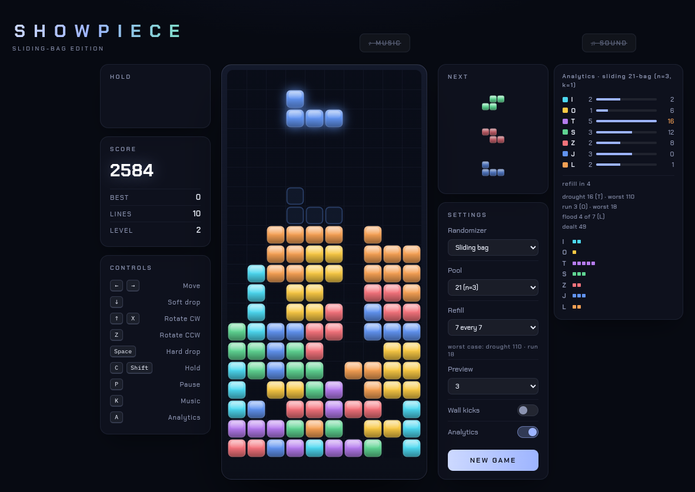

# Showpiece

A falling-block puzzle game in the style of Tetris, built around the sliding bag randomizer. Vanilla JavaScript, no dependencies, no build step.



## Background

I love Tetris-style games. The thing is, I think random pieces are too unforgiving. The 7-bag randomizer, on the other hand, is too predictable. I wanted a randomizer that can give both bursts and droughts, but not stray into completely random territory over time. This is the only randomizer I've seen that is both streaky and fair over time, so it does really earn its spot.

This project gives you a showpiece of the randomizer (hence the name *Showpiece*) in a real game. Complete with a statistics overlay and some other neat features.

The spec for this game was written by Claude Sonnet 5, the implementation was done on my local Qwen 3.8 27B NVFP4 instance. Everything, except the Background and *Is it new?* sections, has been vibe coded and/or AI generated.

## The sliding 21-bag

Modern Tetris games deal pieces from a **7-bag**, where every 7 pieces contain one of each. It's fair, but mechanical: no streaks, no dry spells. **Pure random** has variety, but no memory, so piece counts drift further from fair the longer you play.

The sliding 21-bag sits in between:

1. Start with a pool of 21 pieces, 3 of each.
2. Draw each piece at random from the pool.
3. After every 7 draws, add one of each piece back.

What that gives you:

- **Streaks:** the same piece comes twice in a row 11.9% of the time. That's 2% with the 7-bag and 14.3% with pure random.
- **Fairness with a hard limit:** a piece always stays less than 3 ahead of its fair share and less than 13 behind, however long you play.
- **Self-correction:** the longer you wait for a piece, the more copies of it build up in the pool. Droughts often end in a flood.

[RANDOMIZER.md](RANDOMIZER.md) has the exact limits, comparisons with the 7-bag, NES and TGM randomizers, and scripts that reproduce every number.

## Is it new?

I came up with what I called "the sliding 21-bag", thinking it was new. It turns out others had the same idea before me, the earliest in 2015, but it never caught on or got a proper analysis. [RANDOMIZER.md](RANDOMIZER.md) is my attempt at that, and [RANDOMIZER-RESEARCH.md](RANDOMIZER-RESEARCH.md) credits the earlier work. The research is not exhaustive, but this is it, as far as I can find. Either way, the documentation shows that the sliding bag does earn its spot, with some unique properties.

## Play

Open `index.html` in a browser.

| Key | Action |
|---|---|
| ← → | Move |
| ↓ | Soft drop |
| ↑ / X | Rotate clockwise |
| Z | Rotate counter-clockwise |
| Space | Hard drop |
| C / Shift | Hold |
| P / Esc | Pause |
| M | Sound |
| K | Music |
| A | Analytics |
| Enter / R | Restart after game over |

## Features

- Randomizer modes: sliding bag (pool size and refill size adjustable), 7-bag and pure random.
- Analytics overlay that shows the randomizer's pool live.
- Strict rotation by default. SRS wall kicks are optional.
- Hold, a 0–5 piece preview, T-spins, combos and back-to-back bonuses.

## Test

Requires Node.js 14 or later.

```sh
npm test            # test suites
npm run stats       # randomizer statistics
```

[SPEC.md](SPEC.md) has the full specification.

## License

BSD 3-Clause. See [LICENSE](LICENSE).
